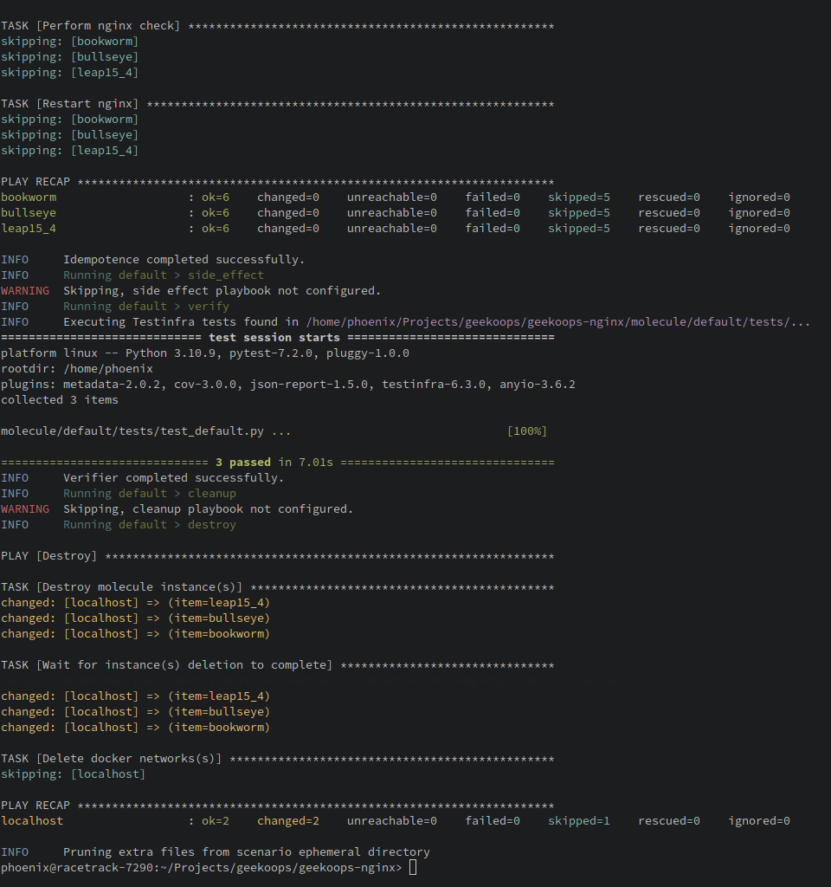

Good ansible roles test themselves using [Ansible Molecule](https://molecule.readthedocs.io/). Molecule itself provides support for testing multiple instances, i.e. OS versions. It can be integrated with GitHub Actions and provides a good way of automated testing of your new roles.

# Getting started

You can take the [geekoops-nginx](https://github.com/GeekOops/geekoops-nginx/tree/main/molecule) project as a template or follow the description below.

* For the GeekOops project, we typically use docker containers with systemd to test the roles on.
* Test runs can be executed on your local computer by running `molecule test`.

## Installation

First, ensure molecule is installed. Although there are packages for openSUSE available, the only supported installation method is via pip

```
pip3 install --user -U molecule
pip3 install --user -U molecule[docker]
pip3 install --user molecule-containers
```

## Basic layout

Inside your Ansible role, there should be a `molecule` folder that contains roughly the following structure

```
molecule/
└── default
    ├── converge.yml
    ├── Dockerfile.leap15_4
    ├── molecule.yml
    └── tests
        └── test_default.py
```

* `molecule.yml` is the **"inventory" of the molecule test**. Contains the definitions of the scenarios. Here we define, on which platforms the test runs and how the scenarios for those test runs look like..
* `converge.yml` is the **"playbook" of the molecule test**. It defines how the host configuration looks like. This is the place where you can configure additional software and system configuration, if needed.
* `Dockerfile.*` - Those are the Containerfiles for creating the test system as required by the `molecule.yml` file.
* `tests/test_default.py` defines the [testinfra](https://testinfra.readthedocs.io) tests that will test the host. Those are python scripts that will test the host after the role has been applied.

# How does it work?

By choosing the `docker` driver in the `molecule.yml` file, the defined `platforms` all will be treaded as docker container, e.g.

```yaml
driver:
  name: docker
platforms:
  - name: leap15_4
    image: registry.opensuse.org/opensuse/leap:15.4
    dockerfile: Dockerfile.leap15_4
    command: ${MOLECULE_DOCKER_COMMAND:-"/usr/sbin/init"}
    privileged: true
    cgroupns: host
    tmpfs:
      - /run
      - /tmp
provisioner:
  name: ansible
  inventory:
    host_vars:
      leap15_4:
        vhosts_dir: "/etc/nginx/vhosts.d"
        deploy_nginx_config: true
verifier:
  name: testinfra
```

This means `molecule` will create a new container image using the provided Dockerfile `Dockerfile.leap15_4`. This will be the platform of the molecule test. Think of this as a virtual machine, where molecule will:

1. Perform some preparation steps according to `converge.yml`.
2. Apply the ansible role according to the definition in the `provisioner` section in the `molecule.yml` file. Mind the `inventory` section and the `host_vars` there. This is the inventory for the molecule test run
3. Run the python tests defined in `tests/` (e.g. `test_default.py`). Those are testinfra test runs that will test the host for the expected changes and functionality.

I stated earlier that the `converge.yml` is the "playbook" of the molecule test run. This is the file where the role needs to be defined, and you can add additional tasks required for the test run. See e.g. the following `convere.yml` file, taken from the nginx role:

```yaml
---
- name: Converge
  hosts: all
  tasks:
    - name: "Include geekoops-nginx"
      include_role:
        name: "geekoops-nginx"
    ## Setup test enviroment
    # Deploy a test site and serve it
    - name: Deploy test page
      copy:
        content: |
          <html>Success! The test page is displayed correctly</html>
        dest: "{{www_dir}}/index.html"
        group: "{{ nginx_user }}"
        owner: "{{ nginx_group }}"
        mode: 0754
      register: deployed
```

Here we include the role itself, but we also need to perform additional tests like creating a test page, which aren't part of the role. This is how you can do it as well.

## Running the test run

On your local machine, you can run a test run simply by

    molecule test

Ensure that the docker daemon is running.

Depending on your configuration a successful test run should look something like the following:



Congratulations! Your ansible role has been tested 😃

## Adding tests

So far we only discussed how you can setup the base structure and configure the host. The second most important part are the actual tests.

Molecule uses [testinfra](https://testinfra.readthedocs.io/) for testing the established environment (i.e. docker containers in this case). Testinfra is a Python framework for writing unit test for testing the state of servers and is well suited for this job.

Tests are located in the `molecule/default/tests` directory and are in essence simple Python scripts that verify the state of the system under test.

Let's take a look at the following test from the nginx role:

```python3
#!/usr/bin/python3
# -*- coding: utf-8 -*-


import testinfra.utils.ansible_runner
import os

testinfra_hosts = testinfra.utils.ansible_runner.AnsibleRunner(os.environ['MOLECULE_INVENTORY_FILE']).get_hosts('all')

def test_phpinfo(host):
	cmd = host.run("curl -v http://127.0.0.1/index.html")
	print(cmd.stdout)
	assert 'HTTP/1.1 200 OK' in cmd.stderr
	assert "Success" in cmd.stdout
	assert "The test page is displayed correctly" in cmd.stdout
```

The `test_phpinfo` method runs `curl` on the test system and verifies if the output matches an expected value.

You can add a new test function there, e.g. `def test_service`:

```python3
def test_service(host):
	nginx = host.service("nginx")
	assert nginx.is_running
	assert nginx.is_enabled
```

The online documentation of testinfra is a good starting point for getting an overview of the available methods and [modules](https://testinfra.readthedocs.io/en/latest/modules.html). The [host](https://testinfra.readthedocs.io/en/latest/modules.html#host) module is the one that should cover most of the needed use cases.

## Integration into GitHub Actions

Consider the following template for running Molecule as part of the integration pipeline:

```yaml
---
name: Test deployment
'on':
  pull_request:
  push:
  schedule:
    # Run every Wednesday at 01:42
    - cron: "42 1 * * 3"

jobs:
  lint:
    name: Lint
    runs-on: ubuntu-latest
    steps:
      - name: Check out codebase
        uses: actions/checkout@v2
      - name: Set up Python
        uses: actions/setup-python@v2
        with:
          python-version: '3.x'
      - name: Install dependencies
        run: pip3 install yamllint
      - name: Lint repository
        run: yamllint .

  molecule:
    name: Molecule
    runs-on: ubuntu-latest
    steps:
      - name: Check out the codebase
        uses: actions/checkout@v2
      - name: Set up Python
        uses: actions/setup-python@v2
        with:
          python-version: '3.x'
      - name: Install dependencies
        run: pip3 install ansible molecule[docker] docker pytest testinfra
      - name: Run Molecule
        run: molecule test
        env:
          PY_COLORS: '1'
          ANSIBLE_FORCE_COLOR: '1'
```

If you put this file into `.github/workflows/CI.yml` and you enable GitHub Actions on your repository, then molecule will run on every pull request and in addition once per week to ensure the role remains healthy.

Remember that GitHub disabled Actions on "inactive" repositories after some time (currently 60 days) of inactivity, so you might need to re-enable the workflows from time to time.