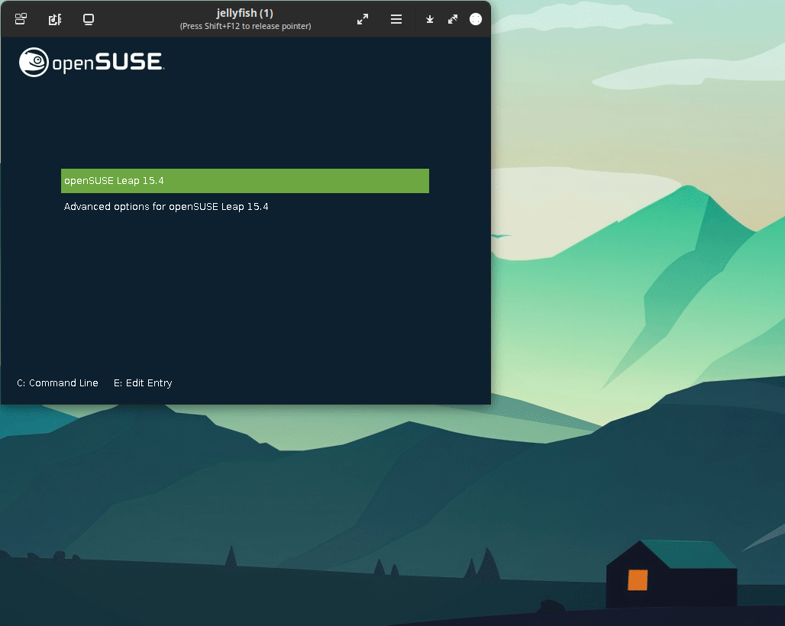
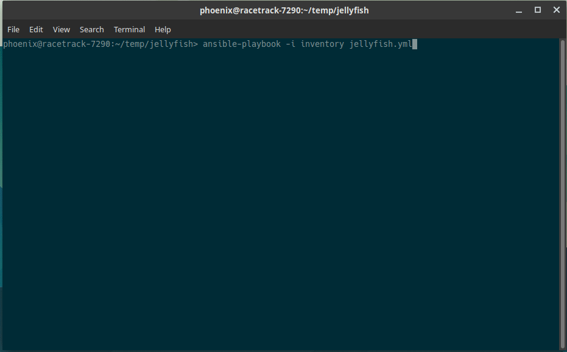
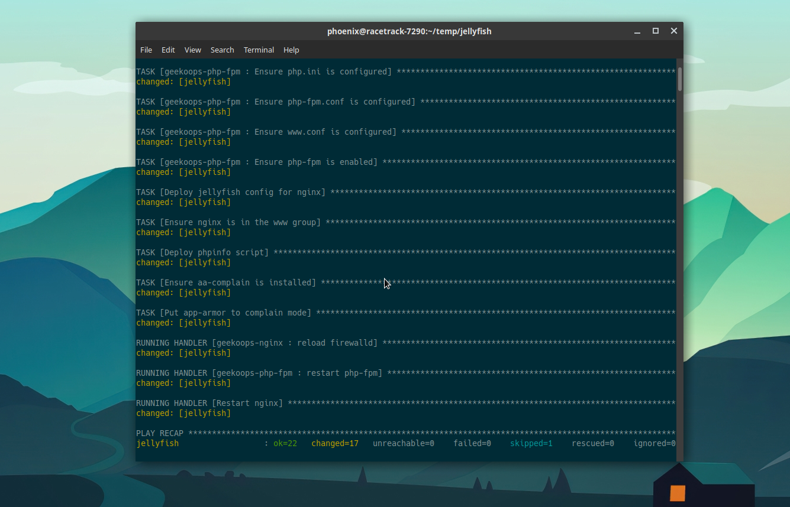
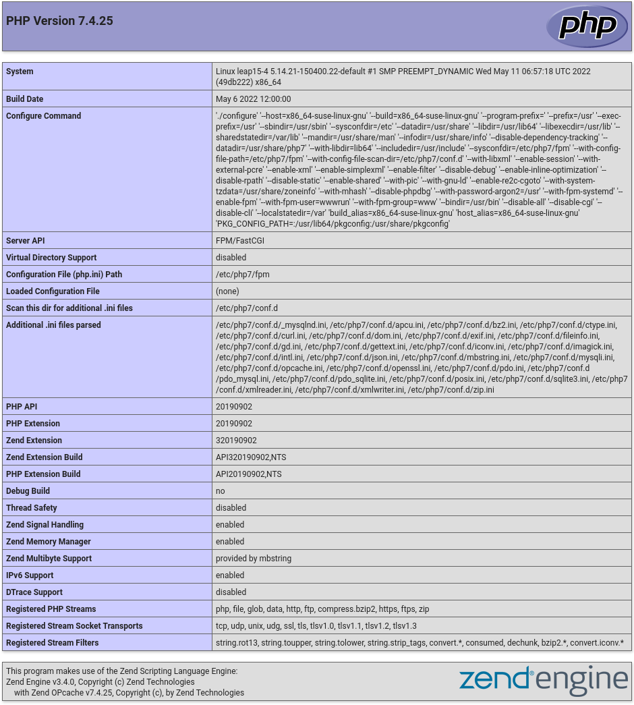

In this post we are going to setup our example `jellyfish` host to run `nginx `and `php-fpm`. Checkout the provided [jellyfish.yml](jellyfish.yml) playbook for a quickstart. This example playbook also configures a virtual host and creates a typical `phpinfo.php` file to test your setup.

This provides a solid example to setup your own webserver running `nginx` with `php-fpm` atop which you can later on run other php applications like [nextcloud](https://nextcloud.com/) or [MediaWiki](https://www.mediawiki.org/wiki/MediaWiki).

## Playbook

The [jellyfish.yml](jellyfish.yml) example playbook sets up a webserver with `nginx` and `php-fpm`:

```yaml
---
- hosts: jellyfish
  user: root

  roles:
    - role: geekoops-nginx
      vars:
        config_firewall: true
        firewall_zone: "public"
    - role: geekoops-php-fpm
      vars:
        apcu_enable: true
        apcu_shm_size: 32M
        php_memlimit: 256M
        php_maxuploadsize: 64M

  tasks:
  - name: Deploy jellyfish config for nginx
    copy:
      content: |
        server {
          listen 80 default_server;
          listen [::]:80 default_server;
          server_name jellyfish;
          root /srv/www/htdocs;
          location / {
              try_files $uri $uri/ =404;
          }
          location ~ \.php$ {
              fastcgi_pass   unix:/run/php-fpm/php-fpm.sock;
              fastcgi_index  index.php;
              fastcgi_param  SCRIPT_FILENAME $document_root$fastcgi_script_name;
              include        fastcgi_params;
          }
        }
      dest: "/etc/nginx/vhosts.d/jellyfish.conf"
      group: "root"
      owner: "root"
      mode: 0754
    notify: Restart nginx
  - name: Ensure nginx is in the www group
    user:
      name: nginx
      groups: www
      append: yes
    notify: Restart nginx
  - name: Deploy phpinfo script
    copy:
      content: "<?php phpinfo(); phpinfo(INFO_MODULES); ?>"
      dest: "/srv/www/htdocs/phpinfo.php"
      group: "www"
      owner: "wwwrun"
      mode: 0754
# Note: The current php-fpm apparmor profile does not allow access to /srv/www.
# We set app-armor to complain in this role. Note that you should use e.g. 
# `yast apparmor` to update your AppArmor profile instead of disabling AppArmor
# as a whole!
  - name: Ensure aa-complain is installed
    package:
      name: apparmor-utils
      state: present
  - name: Put app-armor to complain mode
    shell: aa-complain /etc/apparmor.d/php-fpm

  handlers:
    - name: Restart nginx
      systemd:
        name: nginx
        state: restarted
```


# Step-by-setup guid

Let's start with the basics. First ensure you have `ansible` installed on your host machine

    sudo zypper in ansible

Then, we need a working directory, let's say `jellyfish`.

    mkdir jellyfish
    cd jellyfish

All next steps should be run in this directory.

We first setup a JeOS VM as our playing ground. Skip down to the [Running the playbook](#running-the-playbook) section in case you have already your VM up and running and just want the playbook to run.

## Ready in under 5 minutes: openSUSE JeOS

> No installation required! This VM image is ready in under 5 minutes.

The most easy way of just getting a openSUSE Leap VM running, is to use the JeOS image. JeOS (or MinimalVM) is a slimmed down image that contains just enough to run as a VM. It boots directly from the provided `qcow2` image and does not need to be installed. A handful of configuration steps in the first-run wizard and you're good to go! You have your openSUSE Leap VM up and running in under 5 minutes.
JeOS can be downloaded from https://get.opensuse.org/leap in Alternative Downloads". Download the KVM and XEN image, import it into your `virt-manager` and we're ready to go.

### JeOS VM: Step-by-step guide

Back in our `jellyfish` directory, we first download the VM image (which is also our hard disk)

    $ wget -O jeos-openSUSE-Leap-15_4.qcow2 https://download.opensuse.org/distribution/leap/15.4/appliances/openSUSE-Leap-15.4-JeOS.x86_64-kvm-and-xen.qcow2

Create a `qcow2` overlay, so that multiple machines could in principle use the same `qcow2` image as base and we only store the overlay in a separate image file:

    qemu-img create -b jeos-openSUSE-Leap-15_4.qcow2 -f qcow2 -F qcow2 jellyfish.qcow2 30G

Then we run `virt-install` to setup and run our `jellyfish` server:

    $ virt-install --name=jellyfish --file=$PWD/jellyfish.qcow2 --vcpus=2 --ram=2048 --os-variant=opensuse15.4 --boot hd

After a handful of configuration steps, you have a functional system in just some minutes.



As you can see in this gif, it only took me 1:30 minutes to get a functional openSUSE Leap 15.4 system using the JeOS image.

### Provide ssh access for ansible

Ansible requies ssh access to the machines it is expected to provision. In this example we will assign the `jellyfish` hostname to the VM IP address via `/etc/hosts`. In a more mature environment you might need to update the DHCP server but that's outside of the scope of this tutorial.

First we need to find out the IP address of the VM. For that, we log in via the `virt-manager` console, then run `ip address` (or `ip a` in short) to list the currently assigned IP addresses. See the `192.168.122.116` in the output below:

    # ip a
    1: lo: <LOOPBACK,UP,LOWER_UP> mtu 65536 qdisc noqueue state UNKNOWN group default qlen 1000
        link/loopback 00:00:00:00:00:00 brd 00:00:00:00:00:00
        inet 127.0.0.1/8 scope host lo
           valid_lft forever preferred_lft forever
        inet6 ::1/128 scope host 
           valid_lft forever preferred_lft forever
    2: eth0: <BROADCAST,MULTICAST,UP,LOWER_UP> mtu 1500 qdisc pfifo_fast state UP group default qlen 1000
        link/ether 52:54:00:85:0f:7a brd ff:ff:ff:ff:ff:ff
        inet 192.168.122.116/24 brd 192.168.122.255 scope global eth0
           valid_lft forever preferred_lft forever
        inet6 fe80::5054:ff:fe85:f7a/64 scope link 
           valid_lft forever preferred_lft forever


Now, as root on your local machine, add the IP address to `/etc/hosts` otherwise you will need to replace `jellyfish` by the ip address in all following commands.
We have been adding the last line `192.168.122.116    jellyfish` to your `/etc/hosts` file.

    vim /etc/hosts
    
    # IP-Address  Full-Qualified-Hostname  Short-Hostname
    #
    
    127.0.0.1	localhost
    
    # special IPv6 addresses
    ::1             localhost ipv6-localhost ipv6-loopback
    
    fe00::0         ipv6-localnet
    
    ff00::0         ipv6-mcastprefix
    ff02::1         ipv6-allnodes
    ff02::2         ipv6-allrouters
    ff02::3         ipv6-allhosts
    
    ::1             hotdog
    [...]
    
    # This is what we add here to assign an IP our amazing jellyfish VM
    192.168.122.116    jellyfish


Now let's copy the ssh-key from your host via

    ssh-copy-id root@jellyfish

Done. Check if you can login via `ssh root@jellyfish`. Now would be a good time to power off your VM and create a VM snapshot, so in case something goes wrong in the next step you have your "saved game" slot you can always rollback to.

Remember to remove the `jellyfish` from `/etc/hosts` afterwards, in case you don't want to keep your `jellyfish` :-)

## Running the playbook

First ensure (one more time), that you have root access to `jellyfish`

    ssh root@jellyfish

Back in our `jellyfish` directory, we need to get the roles and the playbook:

    # Download the ansible repositories
    git clone https://github.com/GeekOops/geekoops-nginx
    git clone https://github.com/GeekOops/geekoops-php-fpm
    
    # Download playbook
    curl -o jellyfish.yml https://geekoops.github.io/posts/20210326-example-webserver/jellyfish.yml

Next we need to create an [inventory](https://docs.ansible.com/ansible/latest/user_guide/intro_inventory.html). And inventory is a list of hosts or host groups that belongs to a certain deployment. In our basic setup we only hold the `jellyfish` host, but you can see this really as an inventory of all servers that you would manage via ansible. Let's stay simple here:

    # Create inventory
    echo "jellyfish" > inventory

We now have all ingredients that we need. We have the playbook, we have the roles and we have the inventory. So from here nothing is holding us back, let's fire `ansible` up and run the playbook using `ansible-playbook`:

    ansible-playbook -i inventory jellyfish.yml     # Use the custom inventory instead of the default (/etc/ansible)

Go grab something to drink and let `ansible` sparkle it's magical fairy dust. When you return the playbook has hopefully setup your machines to the desired state:



What you hope for is to see something like the following after about 1-2 minutes of ansible running:



The `ok=22 changed=17 failed=0` tells you that ansible was successful.

Now in your browser navigate to [http://jellyfish/phpinfo.php](http://jellyfish/phpinfo.php) and you should see, the output of phpinfo:



Congratulations. You have successfully deployed a `nginx` + `php-fpm` webserver instance. Time to celebrate!